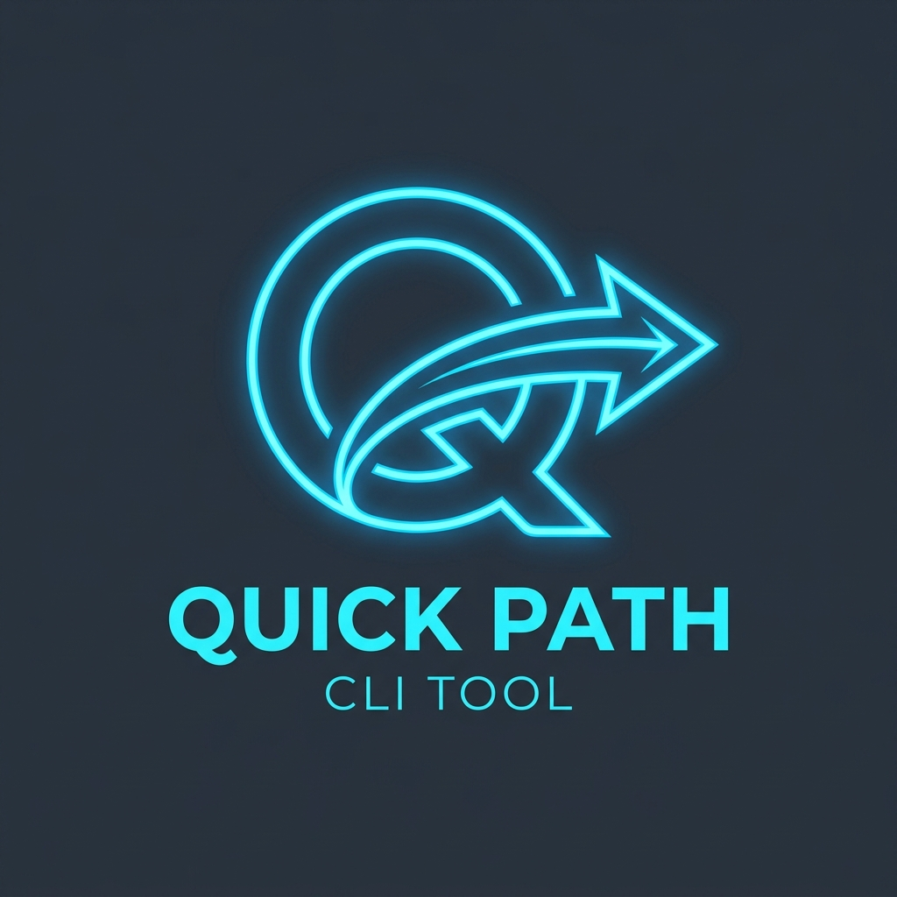

<p align="center">
  
</p>

# 🚀 Quick Path

[](https://opensource.org/licenses/MIT)
[](https://www.python.org/)
[](https://www.microsoft.com/windows)

**Quick Path** is a lightweight, high-speed CLI tool designed for developers and power users who navigate through dozens of project directories and documentation folders daily. Say goodbye to deep directory nesting and fragmented shortcuts.

---

## ✨ Key Features

- **📂 Path Management**: Organize your workspace, documentation, and project paths in a simple `.ini` file.
- **⚡ Rapid Navigation**: Instantly open folders in File Explorer or Windows Terminal with a single keystroke.
- **Smart Clipboard**: Copy paths or capture command output directly to your clipboard.
- **📜 Command History**: Sync command results are automatically logged to SQLite for easy retrieval later.
- **🛠️ Custom Actions**: Define your own shortcuts to launch applications (e.g., VS Code, Antigravity) or run CLI commands.
- **🌗 TUI (Text User Interface)**: A clean, keyboard-driven interface that feels fast and responsive.

## 🛠️ Installation

1. **Clone the repository**:
   ```bash
   git clone https://github.com/your-username/quick_path.git
   cd quick_path
   ```

2. **Run from source**:
   - Install dependencies (if any, standard Python library used):
     ```bash
     python main.py
     ```
   - *Note: Requires `msvcrt` (Windows only).*

3. **Build the executable**:
   We provide a PowerShell script for building a standalone `.exe` using PyInstaller.
   ```powershell
   .\build.ps1
   ```

## 🚀 Getting Started

Launch the application using the executable or `main.py`. The tool will automatically load `main.ini`.

### Controls

| Key | Action |
| :--- | :--- |
| **Arrow Up/Down** | Highlight a path or directory |
| **Enter** | Enter directory / Open file in Explorer |
| **[ .. ]** | Go back to parent / Main menu |
| **[e]** | **Explore**: Open selected path in File Explorer |
| **[t]** | **Terminal**: Open selected path in Windows Terminal |
| **[c]** | **Copy**: Copy path to clipboard |
| **[h]** | **History**: View, re-copy [c], or export [f] past sync command outputs |
| **[q]** | **Quit**: Exit the application |
| **Custom Keys** | Executed defined sync/async commands |

## ⚙️ Configuration (`main.ini`)

Customize your paths and shortcuts in the configuration file.

```ini
[Paths]
Projects = D:\Dev\Projects
Docs = C:\Users\User\Documents

[Commands]
v = VSCODE, code {path}
a = Antigravity, antigravity {path}

[SyncCommands]
g = GitStatus, git status
```

- **[Commands]**: Launch apps asynchronously (background).
- **[SyncCommands]**: Run commands and capture output to the clipboard.
- **{{Parameter}} Support**: Use `{{name}}` placeholders to prompt for user input before command execution.

## 📄 License

This project is licensed under the MIT License - see the [LICENSE](LICENSE) file for details.

---

<p align="center">Made with ❤️ for efficiency by your-name</p>
